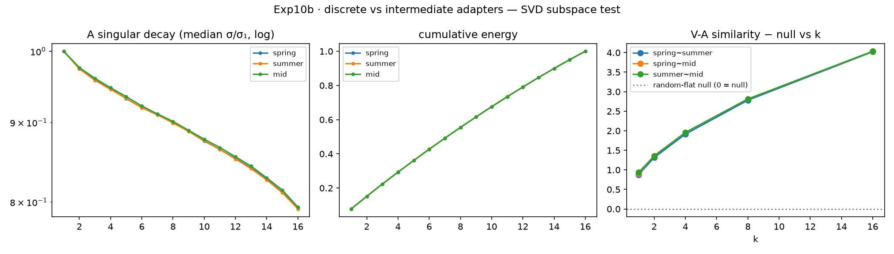

**GRAPHIA** 因一个发现而立：同一个冻结基座上、不同领域的 LoRA 专家，其 $\Delta W$ **写方向近乎正交**
（五域十对 $|\Delta W_{\text{ov}}|_{\max}=0.129$，三种子齐），**读方向完全共享**（15 对 V-A 全平
≈3.8）；把两域数据混成一炉训出的"中间型"**是插值，不是第三空间** —— 概念的可组合性
$W=W_0+\sum_i p_i\Delta W_i$ 因此成立于权重几何，而不成立于输出的可分辨性（两专家在答案
的每个位置上都比各自与基座更像 —— 10c 全序列复审，两种 token 分组定义下同果）。

- 📋 **[实验笔记](notes/exp10-note.qmd)** — 依 Qwen 报告框架六节成文，全部表格经 great_tables 美化（与 MEF 同款），含当日自我审计
- 📄 **论文** — [`paper/exp10-paper.pdf`](paper/exp10-paper.pdf)（tectonic 亲手排版；GRAPHIA 版含图）
- 🔬 **Exp11 矩阵进行中** — P0 (Qwen2.5-1.5B) 已闭：H8 格 PASS（max 0.137，锚点 0.592/0.637），H7 通用探针 PASS（≈0.02 — 通用 LoRA 是第六位正交书写者）；P1 候主人网络点头

数据不出籍：所有数字按 `(path, sha256)` 指回 chora `artifacts/results/exp10|11/`（manifest 四向校验 0 失败）。
本站由 Quarto 织成 —— 与邻案 MEF 同一台织机。
