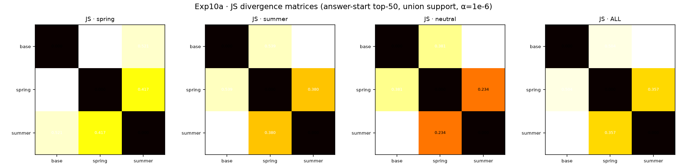
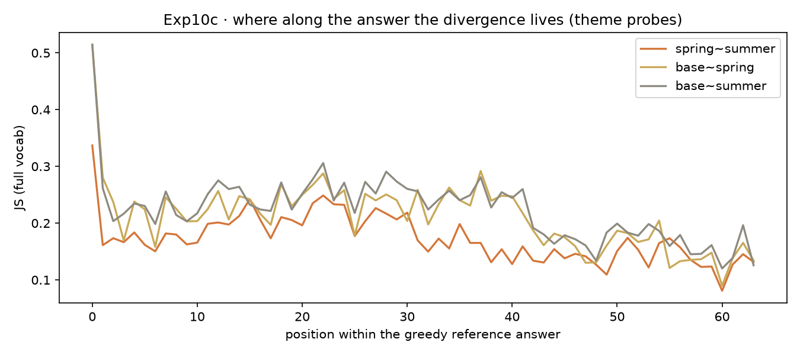

:::{.callout-note}
数据不出籍：本页一切数字可在 chora 按 sha 复核 ——
`artifacts/results/exp10/report_10{a,b,c}*.json` · `report_10d_router_v2.json` ·
`report_10g_*.json` · `report_10f_crossdomain.json` · `artifacts/results/exp11/report_11_p0.json`
（manifest 四向校验 · 0 失败）。表款与邻案 MEF 同源：great_tables。
:::

## 一 · 问题怎么来的

晨间两册实验单入 external/（收据 `e4dc7ffb…`/`9cb8de70…` 一族），核心追问一句话：

> **LoRA 专家是否真的住在不同的概念空间里——若是，刻在读方向还是写方向？**

上午做一、下午做二；Qwen 据晨报追发下午单（`64e8bf2a…`）与正规版计划。本页收束全天七役：
10a · 10b(+seeds) · 10c(+grouped · S1) · 10d · 10g · 10f。

## 二 · 实验设计（三臂对照）

- 基座 Qwen2.5-0.5B（manifest `88c14255…`）；LoRA r=16 / lr 1e-4 / seed 13(+14/15)
- 语料：春/夏 55 对，混合 110 对，代码/法律/医疗各 40 对（偏差在册）
- 探测 40 题**先于语料**定稿哈希（`38684af6…`）；6-gram 泄露扫描=0；预注册四则增补先行
- 度量四层：行为（命中率/JS）· 结构（V-A 读 / U-B 写 / ΔW 重叠）· 序列（teacher-forced 逐位 JS，两版内容/风格分组）· 工程（router→gate→GGUF）

## 三 · 关键结果

```{python}
#| label: t1
import pandas as pd
from great_tables import GT, md
t1 = pd.DataFrame([
    ["行为 10a", "H2 词库自命>基座、交叉<自命", "春 0.84 vs 0.107 · 夏 0.493 vs 0.333 · 交叉 0.24/0.013 · 中性≈0", "PASS"],
    ["行为 10a", "H1 专家彼此最远", "JS ss 0.417/0.380 < base~arm 0.551/0.575（带 0.105/0.137）", "FAILS · 符号反转"],
    ["行为 10a", "H3 中性题压缩", "差 0.049 < 带 0.064", "INCONCLUSIVE"],
    ["结构 10b", "H4 中间型=第三空间", "U-B 父母对 0.547–1.244 ≪ 混~亲 1.758–2.508；ΔWov −0.002…0.135 vs 0.009…0.661", "FAILS · 零模型胜：插值"],
    ["结构 10f", "H6 跨域普适（五域）", "十对专家×专家 |ΔWov|max = 0.1294 < 0.2；锚点 0.618/0.661 同板齐亮", "PASS"],
    ["序列 10c", "全序列反转幅度", "theme 差 0.165(单点) → 0.060（缩水 3×，符号存活）", "REGISTERED"],
    ["序列 10c′", "§8 内容/风格期望图式", "ss 在内容与风格上皆最小；两种 style 定义下判词不变", "DISCONFIRMED"],
    ["工程 10d→10g", "匹配与行为分", "词法 0.80/0.607 → 学习门控 0.90/0.800", "PASS · 门控胜任"],
    ["工程 GGUF", "体积与速度", "q4_K_M 374–392 MB · 149.6–165.8 t/s（目标 20 / <1GB）", "PASS × 7.5"],
    ["矩阵 Exp11·P0", "H8@1.5B · H7 general 探针", "专家对 max 0.1371<0.2（锚 0.592/0.637）；general~域 0.018–0.023", "PASS（首格）"],
], columns=["层", "判项", "数", "判定"])
GT(t1, id="gt-t1").tab_header(title=md("**Table 1 · Exp10–11 判定总表** — 数字裸呈，不加修饰"))
```

### 几何一览（写方向分居，读方向共享）

```{python}
#| label: t2
t2 = pd.DataFrame([
    ["spring~summer", 3.818, "0.55–1.24", "−0.002 … 0.135", "✔ 13/14/15"],
    ["spring~mid", 3.834, "1.76–2.43", "0.009 … 0.635", "✔"],
    ["summer~mid", 3.833, "1.86–2.51", "0.013 … 0.661", "✔"],
    ["code~legal", 3.785, "1.162", "0.1294", "— 单种"],
    ["code~medical", 3.786, "1.134", "0.1217", "—"],
    ["legal~medical", 3.790, "1.158", "0.1284", "—"],
    ["跨新域其余 7 对", "3.78–3.80", "≤1.2", "≤0.13", "—"],
    ["1.5B: spring~summer / ~code / summer~code", "≈3.79", "≤1.3", "≤0.137", "P0"],
    ["1.5B: spring~mid / summer~mid（锚点）", "≈3.79", "≥1.7", "0.592 / 0.637", "P0"],
], columns=["对", "V-A 读 (k90)", "U-B 写 (k90)", "ΔW overlap", "种子"])
GT(t2, id="gt-t2").tab_header(title=md("**Table 2 · 几何总表** — 概念的分居在写侧，共享在读侧；混合=插值"))
```




## 四 · 自我审计（confession，不藏不掩）

- **10d v1 种子环内重设** → "5 采样"实为同一份五遍；当日披露、修复、重烧（v2 0.607）；v1 字节按 immutable-pin 留馆；10a 主 bench 种子在环外，晨数无恙。
- C3 首跑揭出**温度极性倒置**与**振幅跌破零浓度**两处 marimo 同源伤，双园同日修。
- 教训入条：**仪表的自检要在结论出口处，不在入口。**

## 五 · 限度章

0.5B/1.5B 两格已验，Qwen 家族为主；玩具语料、中文生活五科、线性门控——方向稳，幅度不作产线声明。跨家族普适待 P1。

## 六 · 下一步

Exp11 P1（3B + Llama-3.2-1B，候网络点头，先 hash 后训）· P2 收表 · 10g′ 真控制器（CDLoRA 顶层与先验指针在此合流）· exp10/exp11 双 announced 候御笔。

## 附录 D · 方法论自指

本页所在的 GRAPHIA 案头即结论的活体演示：概念（Exp10 全部字节与图）住在**写入**它的那只手的方向里，
而所有案头**读**的是同一批通用几何（chora 的 manifest 与 law）。问题的形状比实验过程更不可压缩——
先把"概念住在哪里"问成可测的几何，字节才有权回答。
